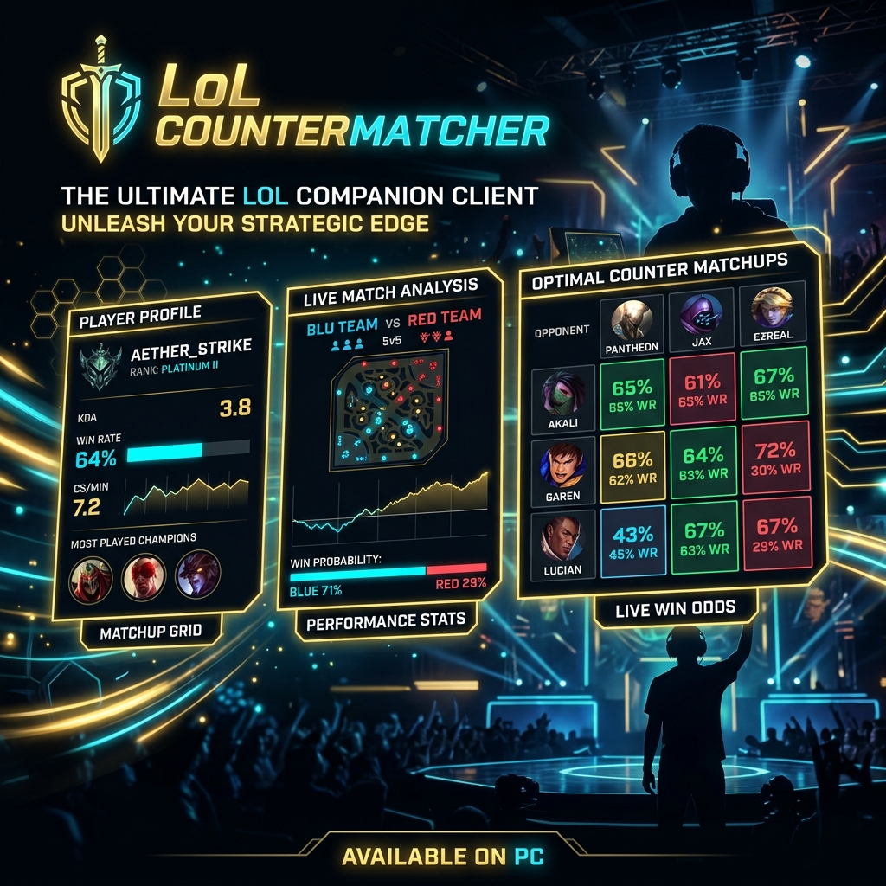

# ⚔️ LoL COUNTERMATCHER v1.0.0



A premium, Riot-compliant companion client and interactive dashboard for League of Legends. This tool monitors LCU and Live Client Game Data in real-time (100% Vanguard-safe) to provide draft advisories, suggested bans, live inventory tracking, gold difference metrics, summoner spell cooldown timers, and automated voice coach gank alerts.

---

## 🚀 Key Features

### 🏛️ 1. Champion Select Advisories
*   **Worst/Best Matchups Explorer**: Toggle lane matchups between champions you counter or champions that counter you.
*   **Draft Composition Auditor**: Warns if your draft lacks frontline tanks, hard crowd control (CC), or has skewed damage balances (e.g., 100% AD or 100% AP).
*   **Pick Order Swap Advisor**: Detects solo lane roles and advises early draft slots to swap pick orders with bot lane or support to maximize counterpick priority.
*   **Pre-Lock Hover Briefing**: Evaluates pick winrates and displays the top 3 biggest lane counters before you lock in.

### ⚡ 2. Live In-Game Interactive HUD
*   **Real-Time Enemy Inventory & Level Tracker**: Syncs level badges, creep scores (CS), and exact item slots for all five opponents.
*   **Defensive Itemization Advisor**: Dynamically evaluates active threat scores (AD vs. AP) and recommends pivot items (e.g., Null-Magic Mantle vs. Cloth Armor).
*   **Team Net Worth Gold Lead**: Aggregates the item gold values of both teams in real-time, flashing green for ally lead or red for enemy lead.
*   **Wave Recall & Reset Timer**: Displays wave spawning timetables and triggers indicators when cannon waves are coming so you can recall efficiently.

### ⏱️ 3. Ultimate & Summoner Cooldown Trackers
*   **Interactive Timer Indicators**: Clickable HUD icons to start cooldowns for enemy ultimates and summoner spells (adapts to level ranks).
*   **Lucidity Boots Auto-Detection**: Automatically detects if an opponent owns Ionian Boots of Lucidity and applies the 12 Summoner Haste cooldown reduction instantly.
*   **Global Hotkey Binds (CTypes listener)**: Trigger cooldown counts without focusing the client window using custom hotkey combos (e.g., `Ctrl+Alt+1..5`).
*   **RespawnSkull Badges**: Shows red skulls and active countdowns on dead enemy portraits, announcing a voice warning when opponents are 10 seconds from spawning.

### 📢 4. Voice Coach Alerts & Custom Notes
*   **Web Speech TTS Alerts**: Speaks warnings 60 seconds and 15 seconds before objective spawns (Grubs, Dragons, Baron) or when gank risk increases.
*   **Custom Matchup Notepad**: A textarea that auto-saves persistent matchup notes locally relative to each champion, displaying them whenever you face that opponent.
*   **Configurable Settings Panel**: Adjust Modifiers (Ctrl/Alt/Shift), TTS coach speech rate/pitch, target voices, default matchups view, and scrape sources.

---

## 📦 Setup & Installation

### Option A: Run Single-File Executable (Easiest / Recommended)
1. Go to the **Releases** page on GitHub and download the latest `LoLCountermatcher.exe`.
2. Run the `LoLCountermatcher.exe` file directly from anywhere on your system. All static interface files and gameplay databases are fully bundled inside the executable, so no external folders or assets are needed!
3. The client will automatically start the background companion server and open the interactive dashboard in your default web browser.

### Option B: Local Development
1. Clone the repository:
   ```bash
   git clone https://github.com/BLS-ISP/LOLCountermatcher.git
   cd LOLCountermatcher
   ```
2. Install Python dependencies:
   ```bash
   pip install -r requirements.txt
   ```
3. Run the FastAPI application:
   ```bash
   python main.py
   ```
4. Open your web browser and navigate to `http://localhost:8000`.

---

## ⌨️ Default Keyboard Hotkeys

You can trigger summoner spell or ultimate cooldown counters on enemies directly from your keyboard even when focused on the League of Legends game window:
*   **Enemy 1 to 5 Summoner Spell 1**: `Ctrl + Alt + [1 - 5]`
*   **Enemy 1 to 5 Ultimate**: `Ctrl + Alt + Shift + [1 - 5]`

*Modifiers and base key presets can be changed in the settings modal (gear icon in the top header).*

---

## 🛡️ Riot LCU Developer Guidelines Compliance

This helper application is **100% Vanguard-Safe** and fully compliant with Riot's developer guidelines:
1. **Zero Memory Injection**: It does not read, write, or inject into the game client process memory.
2. **LCU API Access**: Reads game phases and hovers strictly via Riot's local client port (`/lol-gameflow/v1/session` and `lol-champ-select`).
3. **Live Game API Access**: Pulls neutral objectives, inventory items, and scoreboard scores via the developer endpoint (`https://127.0.0.1:2999/liveclientdata/allgamedata`).
4. **No Automation**: It does not click, move the mouse, cast spells, buy items, or play the game for you. It functions purely as a second-screen information dashboard.
